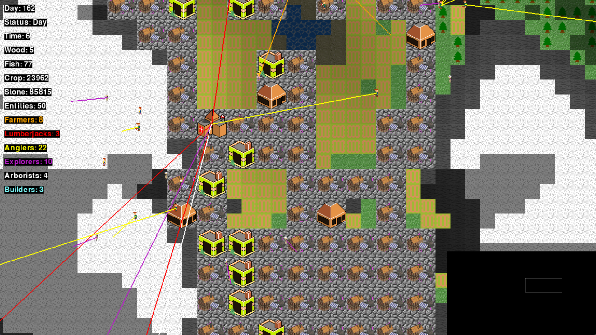

Villager-Sim
============
This is a CS5150 Final Project based on an open-source GitHub repository: https://github.com/najarvis/villager-sim

Villager Sim is a virtual village where AI villagers live. Its final goal is to create a civilization that can grow and explore on its own through AI by setting goals and states.



August, Summer 2024
Group Members: Jianyan Chen, Ruidi Huang, Xin Qi

Start
-----

To run this you must Install PyGame - http://www.pygame.org/download.shtml

```pip install pygame```

We used networkx library in path finding logic, make sure you have it installed before start the game -  https://networkx.org/documentation/stable/install.html

```pip install networkx[default]```

Copy the following line to your terminal:

```python UpdatingVillagerSim.py```

Additional start flags:

```python UpdatingVillagerSim.py [fullscreen] [world size] [hard shadow]```

Example Usage:

```python UpdatingVillagerSim.py 0 64 0```

```fullscreen``` is a boolean value (0 / 1) that controls if the game will start fullscreen or not. WARNING: If running on linux, if the program crashes while in fullscreen mode it is difficult to close.

```world size``` is an integer (preferably an order of magnitude of 2) that controls the dimensions of the tile map of the game world. The game world is a square so you only need to supply the value of one side (e.g. 64).

```hard shadow``` is a boolean value (0 / 1) that controls if the shadow from elevation is rendered on the game world or just the minimap.

Note, you cannot just select ```hard shadow``` without the other two, nor ```world size``` without ```fullscreen```.

You can find the project presentation slides here: https://docs.google.com/presentation/d/147pPRkHVVH6SKW51kCM0nFAqyFPZcu8u1g8Lua2uYO4/edit?usp=sharing

You can find the write-up details about the project here (You need to login with your NEU Email): https://northeastern-my.sharepoint.com/:w:/g/personal/qi_xin2_northeastern_edu/EcNOcY2pp9dIgpau50mDq8gBuOWP37Ikowl3oQcAnJ4vKA?e=KiV3Qx

AI Components
-------
# Features Developed

## Environmental State Update

### Update Time
- **Based on**: 60 frames per second.
- **In-game time**: One second in the game captures 60 frames in the controller (`UpdatingVillagerSim.py`).

### Day and Night Cycle
- **Day duration**: 60 seconds.
- **Daytime**: 38 seconds.
- **Nighttime**: 22 seconds.
- **Villager behavior**:
  - During daytime: Villagers perform their jobs.
  - During nighttime: Villagers return to the town center or manors (depending on distance) to rest.

### Starting Point Finding Rule Update (`World.py`, `find_starting_point(self)`)
- **World generation**: Program allocates a starting point for the village by identifying grids of size 8x8 tiles.
- **Grid selection criteria**:
  - Each grid must contain at least six 2x2 tiles suitable for building.
  - Grids with at least 160 open land tiles (grass/grass with trees) are considered optimal for expansion (farming, forestry, buildings).
  - Adjacent grids must have at least 16 water tiles for fishing.
- **If multiple starting points meet the criteria**: One is randomly chosen.
- **If none meet the criteria**: A new world is generated, and the process restarts.

## AI of Villagers

### Game Entity Update (`GameEntity.py`)
- **Pathfinding**: Integrated A* pathfinding algorithm in the `process(self, time_passed)` method.
- **Food consumption**:
  - Villagers consume 1 unit of food when hunger value drops below 75.
  - Hunger is reduced by 20 at the start of each day.
  - Villagers die if hunger drops below 0.
  - Villagers eat at the start of the day, after resource delivery, or when hungry.
  - Nearest food source (barn or fish market) is selected for food retrieval.
  - If a food type runs out, villagers only search for the other type.

### Debug Info
- **Panel displays**:
  - Time.
  - Resource quantities.
  - Number of each type of villager.
- **Right-click functionality**: See current state and status of individual villagers.

### Villager AI

#### Angler AI (`Angler.py`)
- **Responsibility**: Collecting fish resources.
- **States**: Fishing, Searching, Delivering, Feeding, Idle.

#### Arborist AI (`Arborist.py`)
- **Responsibility**: Planting trees in the world.
- **States**: Planting, Feeding, Idle.

#### Farmer AI (`Farmer.py`)
- **Responsibility**: Growing crops and harvesting them to maintain food supply.
- **States**: Tilling, Searching, Sowing, Watering, Harvesting, Delivering, Feeding, Idle.

#### Explorer AI (`Explorer.py`)
- **Responsibility**: Finding stones and bringing them back.
- **States**: SearchStone, CollectStone, Return, UnloadStone, Exploring.

#### Lumberjack AI (`Lumberjack.py`)
- **Responsibility**: Chopping trees and bringing wood back.
- **States**: Searching, Chopping, Delivering, Feeding, Idle.

### Populate
- **Conditions for population growth**:
  - Fish and crops are 100 times beyond the population count.
  - Number of fish and crops is more than 100 each.
- **Effect**: A random type of villager spawns.

### Builder and Building (`Builder.py` and `Buildings.py`)
- **Builder behavior**:
  - If only one builder: Start building immediately.
  - If multiple builders: Additional builders assist, speeding up construction.
- **Building location search**:
  - Grid search with a given radius to find space for new buildings.
  - If no 2x2 space is available, the radius is extended until space is found.
- **Building types**:
  - **Town Center**: Where the village starts.
  - **Barn**: Stores crops.
  - **Manor**: Residential buildings.
  - **Stonework**: Stores stones.
  - **Under Construction**: Buildings under construction.
  - **Fish Market**: Stores fish.
  - **Lumber Yard**: Stores wood.
- **Resource delivery**:
  - Villagers deliver resources to the nearest available building.

## 2.3 Path Finding and Visualization

### Pathfinding Logic (`PathFinding.py`)
- **Algorithm**: A* pathfinding algorithm is used instead of direct pathfinding.
- **Improvements**:
  - Added a new `cost` attribute for the `Tile` class to support A* calculations.
  - Used the NetworkX library to build the search tree and implement A*.

### Visualization Indicators for Pathfinding (`Visualize.py`)
- **Indicators**:
  - Lines from the current location of entities to their destinations.
  - Different colors for lines representing different villager types.


Licence
-------

GNU GENERAL PUBLIC LICENSE Version 2
